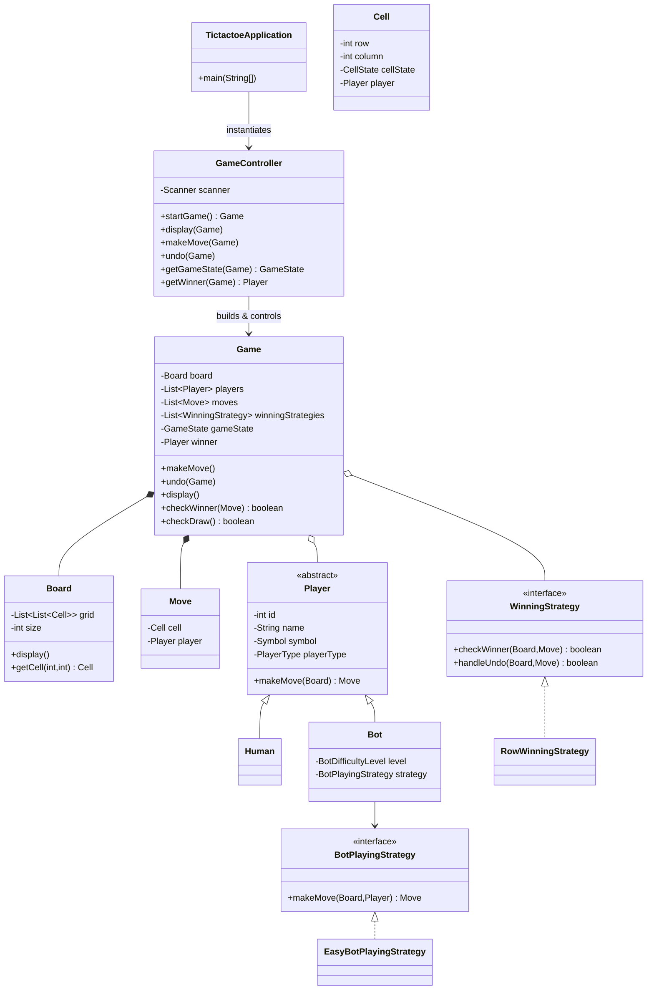

[# TicTacToe Console Engine

## Overview
This project is a console-first TicTacToe engine built with Java 17 and the Spring Boot scaffolding (Boot is currently disabled in `main`). The game runs entirely through standard input/output and relies on a lightweight domain model to represent boards, players (human or bot), moves, and winning strategies. The application emphasizes clean separation between the controller (`GameController`), the game domain (`Game`, `Board`, `Move`, etc.), and pluggable strategy interfaces.

- **Entry point:** `TictactoeApplication.main`
- **Interaction style:** CLI prompts via `Scanner`
- **Extensibility:** Winning and bot-playing strategies are injected at runtime based on user input.

## Project Structure

```
src/main/java/com/utsavi/tictactoe
├── TictactoeApplication.java      # Entry point, orchestrates game lifecycle
├── GameController.java            # Gathers inputs, invokes Game operations
├── Game.java                      # Core domain logic (state machine, moves, undo)
├── Board.java / Cell.java         # Board representation & rendering
├── Player.java                    # Base player abstraction
│   ├── Human.java                 # Reads moves from stdin
│   └── Bot.java                   # Delegates to BotPlayingStrategy
├── Move.java / Symbol.java        # Value objects
├── enums (PlayerType, GameState, CellState, BotDifficultyLevel)
└── stratergies/                   # Pluggable strategies (bot + winning)
```

## Key Classes & Responsibilities

| Component | Responsibility |
|-----------|----------------|
| `TictactoeApplication` | Sets up a `GameController`, starts the game, drives the main loop, and announces results. |
| `GameController` | Collects configuration (board size, players, strategies), exposes thin wrappers around `Game` (display, makeMove, undo, getter helpers). |
| `Game` | Holds board, players, move history, winning strategies, and acts as the state machine for move validation, updates, win/draw detection, and undo logic. |
| `Board` & `Cell` | Represent the NxN grid, expose `display()` and cell-level mutations. |
| `Player` hierarchy | `Human` prompts via CLI, `Bot` delegates to a `BotPlayingStrategy` derived from `BotDifficultyLevel`. |
| `WinningStrategy` implementations | Determine win conditions per move. Currently, only `RowWinningStrategy` is wired in, while Column/Diagonal are stubs ready for extension. |
| `BotPlayingStrategy` implementations | Define how bots choose a `Move`. Only `EasyBotPlayingStrategy` is implemented; Medium/Hard are placeholders. |

## Class Diagram



## Execution Flow (from `TictactoeApplication.main`, line 25)

1. **Bootstrapping**
   - Line 17: `GameController` is instantiated (a future singleton placeholder).
   - Line 25: `startGame()` is invoked, which sequentially:
     1. Prompts for the board dimension (`GameController#getDimensions`).
     2. Builds the player list (`getPlayers`) by optionally inserting a bot and then collecting human player metadata (name + symbol).
     3. Collects winning strategies (`getWinningStrategy`). Currently only `RowWinningStrategy` can be toggled via CLI, while column/diagonal flags are commented out.
     4. Constructs a `Game` with the user-provided inputs. The `Game` constructor creates a fresh `Board`, sets the state to `IN_PROGRESS`, clears the winner, and initializes the move history.

2. **First render**
   - Line 26: `display(game)` delegates to `Game.display()`, which calls `Board.display()` to print the empty grid.

3. **Gameplay loop**
   - Lines 28–43: `while (gameController.getGameState(game) == IN_PROGRESS)` keeps running until a win or draw is detected.
   - Inside each iteration:
     1. `makeMove(game)` → `Game.makeMove()` picks the next player (`nextPlayerIndex`).
     2. `Player.makeMove(board)` is dispatched. For `Human`, row/column are read from stdin; `Bot` defers to its injected `BotPlayingStrategy` (Easy bot picks the first empty cell, others are TODOs).
     3. `Game.validateMove(move)` ensures the row/column is on-board and the target cell is empty.
     4. `Game.updateGame(move, currentPlayer)` stamps the board cell, rotates `nextPlayerIndex`, and records the move history.
     5. `Game.checkWinner(move)` iterates through all configured `WinningStrategy` instances; `RowWinningStrategy` counts occurrences of each symbol per row and declares victory when a row is filled by one symbol.
     6. If no winner, `Game.checkDraw()` compares the number of moves with `size*size` to detect stalemates.
     7. After the move, `display(game)` re-renders the board.
     8. Players are prompted for an undo. If `Y`, `undo(game)` pops the last move, resets the cell, rewinds `nextPlayerIndex`, and calls `WinningStrategy.handleUndo` (row counter decrements). The game state is reverted to `IN_PROGRESS` and the winner is cleared.

4. **Termination & result announcement**
   - Once `GameState` changes to `SUCCESS` or `DRAW`, the loop ends.
   - Lines 45–49: `getWinner(game)` is evaluated. If `SUCCESS`, the winner’s name is printed. Otherwise the game is declared a draw.

### Data & Control Flow Summary

- **Main ↔ Controller:** `TictactoeApplication` is responsible for console I/O prompts that wrap controller calls. The controller remains a thin facade and exposes only domain-safe operations.
- **Controller ↔ Game:** `GameController` never mutates the game directly; it calls semantic methods (`startGame`, `makeMove`, `undo`, `display`) and reads state via getters. This separation allows future exposure through REST or GUI interfaces.
- **Game ↔ Domain Objects:** `Game` owns the board, players, strategies, and move history. It ensures all mutations are consistent (board update, move list, next player pointer, strategy bookkeeping) and centralizes validation.
- **Strategies & Bots:** Both winning and bot behaviors are defined through interfaces to encourage future additions (e.g., diagonal wins, minimax bot). Undo hooks ensure strategy-specific caches stay coherent.

## Running the Game

```bash
./mvnw clean package
java -jar target/tictactoe-*.jar   # or run TictactoeApplication from your IDE
```

> **Note:** `SpringApplication.run` is commented out in `main`, so running via the IDE/`java` entry point executes the CLI game directly.

## Future Improvements

1. Implement `ColumnWinningStratergy` and `DiagonalWinningStrategy`, then re-enable their configuration prompts.
2. Provide actual logic for `MediumBotPlayingStratergy` and `HardBotPlayingStratergy` (e.g., heuristic or minimax).
3. Convert `GameController` into a true singleton/service bean if the app transitions to REST/WebSocket exposure.
4. Add automated tests covering move validation, undo, and winning strategy behavior.

